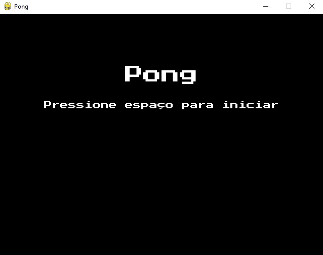
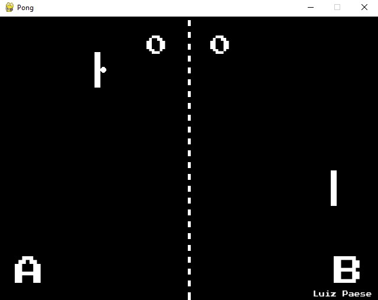
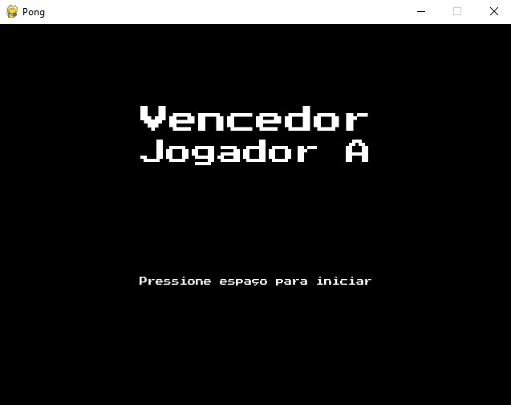

# PONG

Repositório criado para desenvolvimento de um jogo baseado no [Clássico PONG](https://g.co/kgs/AwrcFE).

## Instalação de requisitos
No seu terminal, execute o comando ``pip install -r requirements.txt``. 
Este comando faz a instalação dos pacotes necessários para que o jogo rode corretamente.

## Iniciando o jogo
Para iniciar o jogo basta executar o comando ``python pong.py``. 
É levado em consideração que a estrutura de pastas é a mesma deste repositório.  
**Opcionalmente, você pode baixar o arquivo ``.exe`` neste [link](https://github.com/luizpaese/pygame/releases/download/v1.0/pong.zip)**

### Screenshots
  
  
  
  
